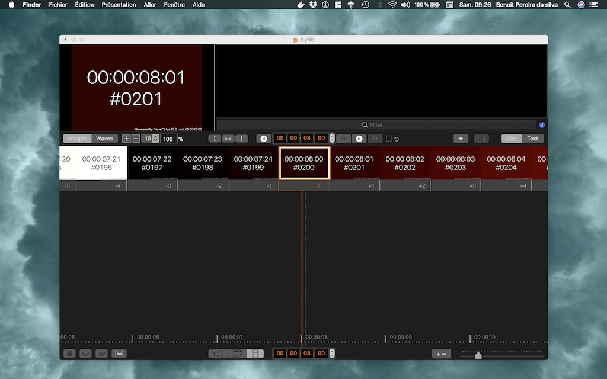
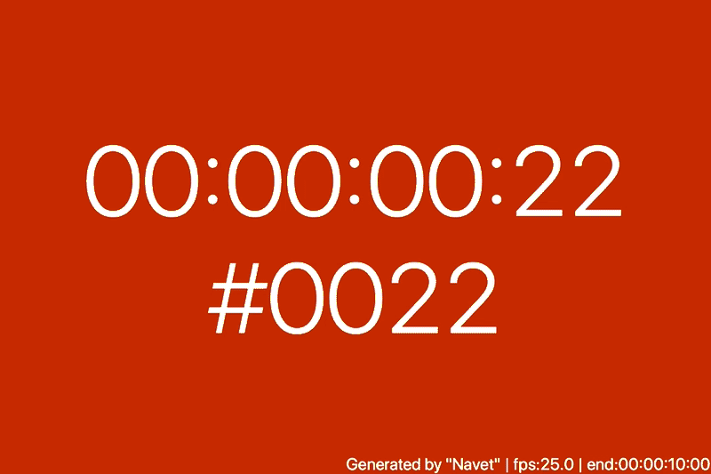

# mp

[](https://swift.org)  [](https://developer.apple.com/platforms/) 

`mp`is a video media processor command line tools built on the top of Apple video Foundation. `mp` can process local and distants video. It supports distant authentication using Bearer Token Authentication.

It uses some sub packages [MPLib](https://github.com/benoit-pereira-da-silva/MPLib), [NavetLib](https://github.com/benoit-pereira-da-silva/NavetLib), that support on macOS, iOS and tvOS.


# How to install *mp*

1. Clone `https://github.com/benoit-pereira-da-silva/mp.git`
2. Move to the `mp/` folder.
3. Build the release :  `swift build -c release -Xswiftc -static-stdlib`
4. Copy the executable to the bin path: `cp ./.build/x86_64-apple-macosx10.10/release/mp  /usr/local/bin/`


# Commands overview :

Valid calls are S.V.O sentences like:"mp <sub command> [options]"

- `mp version`: returns the current version of mp
- `mp help` : displays the general help
- `mp <subcommand> help`: displays the sub command help.
- `mp detect-shots`:  detects the shots from a file or an URL and saves the result into a json file 
- `mp generate-video`:  creates a video placeholder


# `mp detect-shots` command

In filmmaking and video production, a shot is a series of frames, that runs for an uninterrupted period of time. `mp detect-shots` detect the shots from a file or an URL and saves the result into a json file 

` mp detect-shots help`

```
Usage: mp detect-shots [options]
  -i, --input:
      The media file URL or path (supports Bearer tokens)
  -o, --output:
      The optional Output file URL or path. If not set the result will be printed to the standard output. In case of URL usage + token it POST the file with the token in an HTTP Authorization Header
  -a, --authorization-token:
      The optional Authorization bearer token (for media URLs)
  -s, --starts:
      The optional starting time stamp in seconds (double)
  -e, --ends:
      The optional ends time stamp in seconds (double)
  -t, --threshold:
      The optional detection threshold (integer from 1 to 255)
  -p, --pretty-json:
      Should the result be pretty encoded (default is false)
  -v, --verbose:
      If verbose some progress messages will be displayed in the standard output.
```


## Samples

Detect the shots of a local file

`mp detect-shots -v -s 60 -e 120 -i ~/Desktop/1.mp4 -o ~/Desktop/1.shots.json`


### Distant video 

Detect the shots in the second minute of Big buck bunny :

`mp detect-shots -v -s 60 -e 120 -i https://download.blender.org/peach/bigbuckbunny_movies/BigBuckBunny_320x180.mp4 -o ~/Desktop/BigBuckBunny.shots.json`


```json
{
  "shots": [{
    "detectionValue": 45,
    "time": 60.6875,
    "timeCode": "00:01:00:16"
  }, {
    "detectionValue": 71,
    "time": 63.8125,
    "timeCode": "00:01:03:19"
  }, {
    "detectionValue": 68,
    "time": 69.4375,
    "timeCode": "00:01:09:10"
  }, {
    "detectionValue": 87,
    "time": 71.3125,
    "timeCode": "00:01:11:07"
  }, {
    "detectionValue": 63,
    "time": 73.479166666666671,
    "timeCode": "00:01:13:11"
  }],
  "stats": {
    "startTimeString": "00:01:00:00",
    "imgPerSecond": 34,
    "cliVersion": "1.0.5",
    "endTime": 120,
    "elapsedTime": 41.053743958473206,
    "averageImageComparisonResult": 3,
    "endTimeString": "00:02:00:00",
    "frameDuration": 0.041666666666666664,
    "startTime": 60,
    "numberOfFrames": 1440,
    "elapsedTimeString": "00:41"
  },
  "source": {
    "height": 180,
    "origin": 0,
    "originTimeCode": "00:00",
    "width": 320,
    "fps": 24,
    "duration": 596.45899999999995,
    "url": "https:\/\/download.blender.org\/peach\/bigbuckbunny_movies\/BigBuckBunny_320x180.mp4"
  }
}
```


# `mp generate-video`command 

Command line video generator that does not create masterpieces but useful video placeholders. Relies on [NavetLib](https://github.com/benoit-pereira-da-silva/NavetLib)

```shell
# mp navet help
Usage: mp generate-video [options]
  -d, --duration:
      The duration in seconds
  -f, --fps:
      The number of frame per seconds (default 25)
  -p, --video-file-path:
      The video file path. If undefined we will create a navet folder on the desktop
  --color-mode:
      "uniform" "random" or "progressive" (default is "progressive")
  -w, --width:
      The width of the video (default 1080)
  -h, --height:
      The height of the video (default 720)
  --file-type:
      "mov" "m4v" or "mp4" (default is "mov")
  --codec:
      "hevc" "h264" "jpeg"  "proRes4444" or "proRes422" (default is "h264")
```

## Usage Samples


- `mp navet -f 60 -d 10 --codec h264 -w 640 -h 480` will generate a progressive video placeholder at 60fps of 10 seconds using h264 in VGA.
- `mp navet -f 30 -d 10 --codec proRes4444 -w 1080 -h 720` will generate a progressive video placeholder at 30fps of 10 seconds using proRes4444 in 1080p.





###  A sample script to generate some 720p references

```shell
#!/bin/sh
# 720p
for durationInSeconds in 100
do
	for fps in 24 25 30 60
	do
		for codec in h264 hevc jpeg proRes4444 proRes422
		do
			mp generate-video -f $fps -d $durationInSeconds --codec $codec -w 1280 -h 720
		done
	done
done
```


# How to debug and launch *mp* from *xcode*?

Check [Using the Package Manager on swift.org](https://swift.org/getting-started/#using-the-package-manager) if your not familiar with the Swift Package Manager (SPM).

1. You need to have the xcode tools installed (xcode 10.1 / Swift 4.2)
2. Run move to your fork or clone, and run `./core-dev-install.sh`
3. Call `mp version` it should display `mp`'s version.
4. Open mp.xcworkspace to start experimenting. 


# Contact 

[Drop me a message on pereira-da-silva.com](https://pereira-da-silva.com)


